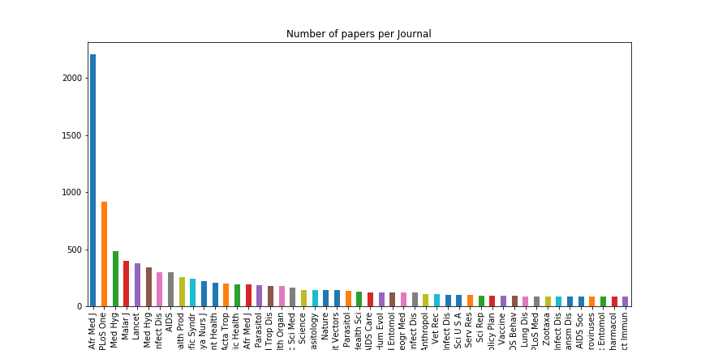

### Status of Open Science in Kenya: Data Analysis Report

We managed to download about 25,000 paper abstracts with meta-data from Kenyan Authors. Now, we need to make sense of this data and identify trends. We were asking questions like:

1. Were there changes in the number of papers published over time (Yearly)
2. Were there changes in the number of open access papers over the years (Keep in mind that access of the lack thereof maybe linked to embargo periods)
3. What are the collaboration trends (How can we get this information?
4. What else can we find out?

So far, this is what we have observed. 

#### Popular Journals for Kenyan Authors

  
From the figure above, we can observe that the East Africa Medical Journal is by far the most popular followed by Plos One Journal for Kenyan Authors. This is followed in a distant second by Malaria Journal. Most of these are journals specific to the diseases affecting Africa: Malaria and Neglected Tropical diseases. 

### Number of Journals per Year

Now we need to check the number of Journals Published By Kenyans over the years. 

From the above figure, either we are missing some data from before 2007, there was a sharp increase in publications starting 2008. Eitherway, we need to figure out why. 

**NB:** After double checking the data, we observe that the plot now makes sense.
